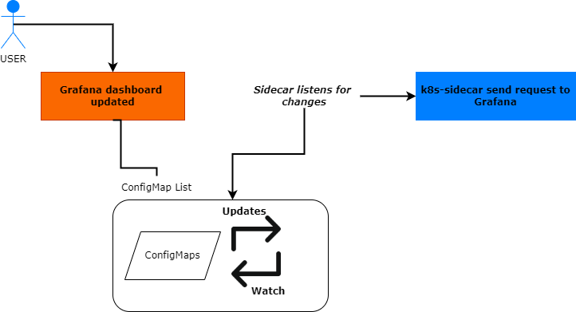

# About

This is a HELM chart created to deploy Kiwigrid's k8s-sidecar inside a kubernetes cluster to collect ConfigMaps with a specified label and store the included files in an local folder. It can also send a HTTP request to a specified URL after a ConfigMap change. The main target is to be run as a sidecar container to supply an application with information from the cluster. The contained python script is working with the Kubernetes API 1.10

# How ?
Install this HELM chart runing the k8s-sidecar container on the cluster.
```bash
helm install k8s-sidecar ./k8s-sidecar
```

Specify which label should be monitored and where the files should be stored. By adding additional ENV variables the container can send a HTTP request to specified URL.

# Features

* Extract files from config maps
* Filter based on label
* Update/Delete on change of configmap

# Contributions

In order to make it work without a shared volume with Grafana we had to modify a little the source code which was written in Python. We applied the modification via a  ConfigMap that can be found in the following path:
```bash 
./k8s-sidecar/templates/configmap.yaml
```
Also:
- We added support for DELETE, when the ConfigMap gets deleted it creates a request and the dashbord deletes as well from Grafana.*   

- Added labels for folderID and folderUid


### *Note
Moving dashboards is currently not supported, in order to move a folder you have to first delete the ConfigMap(dashboard) then apply it again with the right label

# Configuration Environment Variables

`LABEL`

* description: Label that should be used for filtering
* required: true
* type: string

`FOLDER`

* description: Folder where the files should be placed
* required: true
* type: string

`FOLDER_ANNOTATION`

* description: The annotation the sidecar will look for in configmaps to override the destination folder for files, defaults to "k8s-sidecar-target-directory"
* required: false
* type: string

`NAMESPACE`

* description: If specified, the sidecar will search for config-maps inside this namespace. Otherwise the namespace in which the sidecar is running will be used. It's also possible to specify ALL to search in all namespaces.
* required: false
* type: string

`METHOD`

* description: If METHOD is set with LIST, the sidecar will just list config-maps and exit. Default is watch.
* required: false
* type: string

`REQ_URL`

* description: URL to which send a request after a configmap got reloaded
* required: false
* type: URI

`REQ_METHOD`

* description: Request method GET(default) or POST
* required: false
* type: string

`REQ_PAYLOAD`

* description: If you use POST you can also provide json payload
* required: false
* type: json

`REQ_RETRY_TOTAL`

* description: Total number of retries to allow
* required: false
* default: 5
* type: integer

`REQ_RETRY_CONNECT`

* description: How many connection-related errors to retry on
* required: false
* default: 5
* type: integer

`REQ_RETRY_READ`

* description: How many times to retry on read errors
* required: false
* default: 5
* type: integer

`REQ_RETRY_BACKOFF_FACTOR`

* description: A backoff factor to apply between attempts after the second try
* required: false
* default: 0.2
* type: float

`REQ_TIMEOUT`

* description: many seconds to wait for the server to send data before giving up
* required: false
* default: 10
* type: float

`SKIP_TLS_VERIFY`

* description: Set to true to skip tls verification for kube api calls
* required: false
* type: boolean


# Solution Deep Dive

In robotics and automation, a control loop is a non-terminating loop that regulates the state of a system.
Basically, a controller tracks at least one Kubernetes resource type. These objects have a spec field that represents the desired state. The controller(s) for that resource are responsible for making the current state come closer to that desired state.

Kubernetes takes a cloud-native view of systems, and is able to handle constant change.
Your cluster could be changing at any point as work happens and control loops automatically fix failures. This means that, potentially, your cluster never reaches a stable state.
As long as the controllers for your cluster are running and able to make useful changes, it doesn't matter if the overall state is stable or not.

k8s-sidecar is implementing the controller pattern which generally looks like this:


Basic overview of how it works in our case:



### Security
 We need to grant access and apply the role, and rolebinding resources in order to grant access of the controller to the configmaps